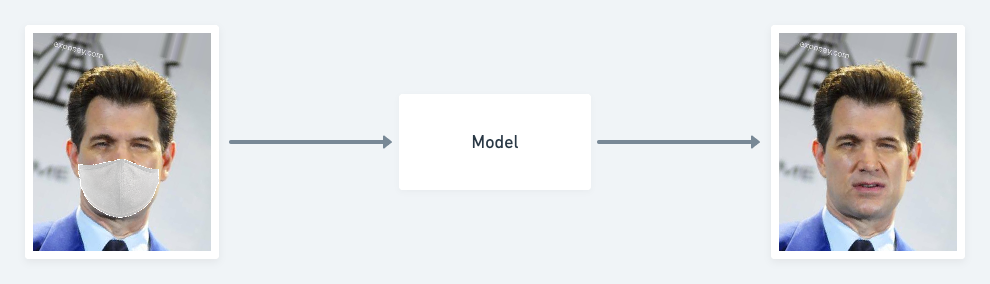

# unmask_face

## Objective

## Dataset

### 1. Get CelebFace dataset

<blockquote>
Dataset of around 800k images consisting of 1100 Famous Celebrities and an Unknown class to classify unknown faces.

All the images have been scraped from Google and contains no duplicate images. Each Celebrity class(folder) consists approximately 700-800 images and the Unknown class consists of 100k images.

Total Size of the Dataset - 172 GB. Total number of zipped files - 12

Link for the DataSet: https://drive.google.com/drive/folders/0B5G8pYUQMNZnLTBVaENWUWdzR0E?usp=sharing
</blockquote>

---

### 2. Generate mask-unmask pair images

- refer this [tool](https://github.com/aqeelanwar/MaskTheFace)

---

## Model

### Candidates of architecture

1. [UNet](https://wewinserv.tistory.com/30)-AutoEncoder

2. [pix2pix](https://www.tensorflow.org/tutorials/generative/pix2pix)

---

## To-do
1. Implement inferencer
2. Implement streamlit backend, fast-api MSA
3. React-native based front-end app development
